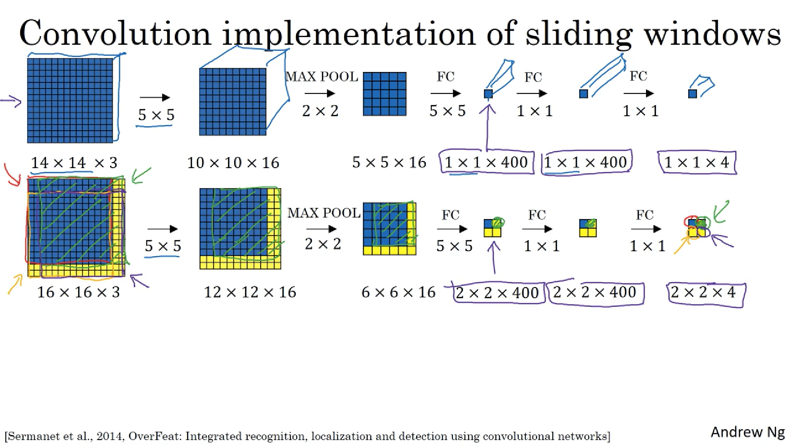
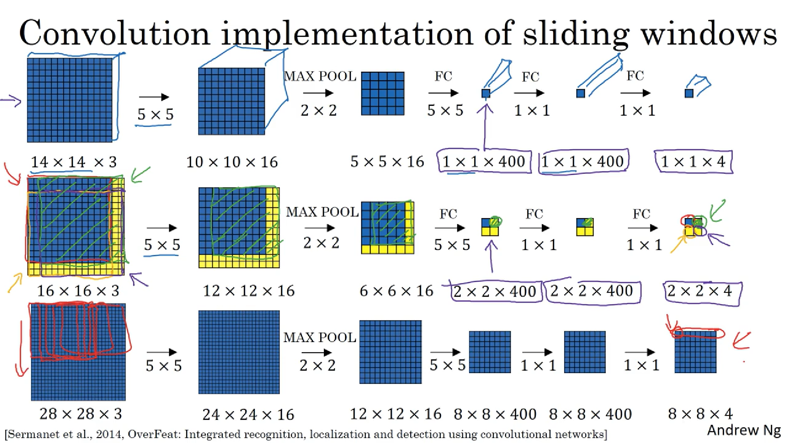
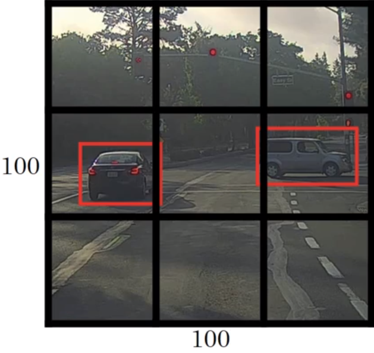
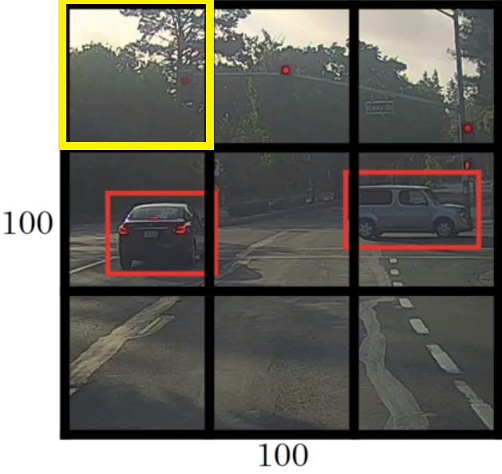
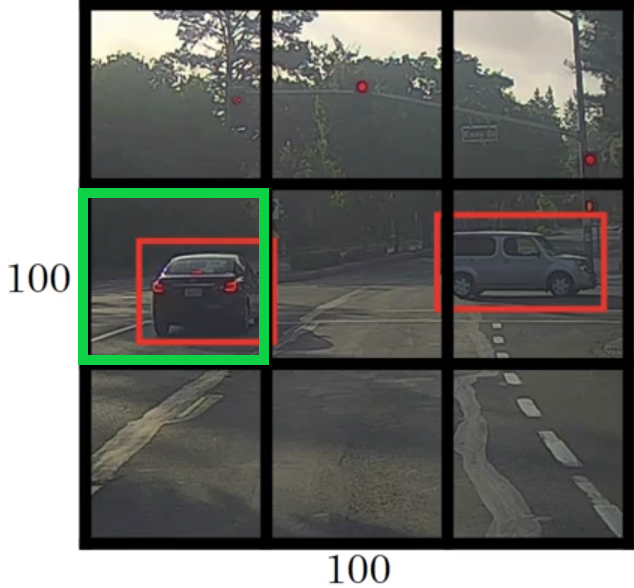

## Object Detection Algorithms

Image Classification - Assign labels to input images
Localization - Assign labels to a localized portion of the image[bounding box]
Detection - Detect and localize multiple objects in a scene

Classification and Localization will often have a single object in the center of the input. Detection will consist of multiple objects spread throughout the scene in the image

## Classificaton with Localization

For classification - usually a softmax with n units corresponding to n output labels
For localization, use 4 more output units that parameterize the bounding box around the object

The four units are bx, by, bh, bw. bx and by represent the center of the bounding box, while bh and bw represent the height and width of the box respectively(with respect to the input image).

Convention:
    Upper left - (0,0)
    Lower right - (1,1)

Training set now also contains 4 additional fields for each image, representing the 4 parameters described above.

Target variable y is a vector with 8 fields(for 3 possible target variables) with 3 distinct categories 
    a. pc - probability that the input contains an object
    b. bx by bh bw indicating the bounding box co-ordinates for the object
    c. c1 c2 c3 which is a one hot encoding indicating which of the object categories is present in the input

## Landmark Detection

Landmarks - important points in an image

Essentially, output more variables in the final layer, with each landmark to be detected contributing two(for 2D landmarks) variables(x and y coordinates) to the final layer.

Landmark detection is essentially adding more output units, and using supervised learning to compute the coordinate values for those units, giving a abstract map of the landmark you're trying to detect.

The identity of each landmark has to be across the entire dataset.

## Object Detection
Using Sliding Window 

1. Create labeled training set with 'closely center cropped' images of car(or not)
2. Train convnet on input to output whether input has car or not

Sliding window:
    Break down the input into multiple windows of the same size(think kernel maps) and pass the entire image as input to the convnet in successive strides. Repeat for larger window sizes.

    Choice of strides and window size is important. Convnet will need to be modified for different window sizes, or maybe build different architectures that accept different input sizes and pass parallely. 

    Computational cost: High cost as there's repeated runs throught the network. Stride choice affects the computational power required for each run.

    Unless stride is very small, chances are you won't be able to localize the object in the image scene.

Convolutional Sliding Window:
How to turn FC into Convolutional layers?
    
Consider: Input:(14,14,3) passed to 16 (5,5) filters    
                L1: (10, 10, 16) passed to (2, 2) maxpool
                L2: (5, 5, 16) passed to FC1
                L3: 400 FC units passed to 400 FC units
                L4: 4(for 4 classes) softmax units indicating probabilities of whether the object is detected in the image or not.
    
For efficient implementation, we need to reduce the number of parameters which means we have to reduce the FC layers to convolutional layers.

How to convert FC layers into Convolutional?

Using the ideas expressed in the image, let's look at the convolution implementation of sliding windows

Important idea: A lot of operations done by a 'vanila' implementation of sliding window is duplicated. Solution?

Let's consider a (16,16,3) test input image. Pass the input(14,14,3) with appropriate stride 

It turns out that final (2,2,4) output is equivalent to the four passed it would take using a vanila implementation.

What if you had even larger images?

This algorithm still doesn't give precise bounding box predictions.
    
## Bounding Box Predictions
It may happen that iteratively passing a small chunk of the image through the convnet might not lead to the best 'intersection' over the object to be bounded, depending on the stride and the size of the image and the filters chosen.

Alternative? 

## YOLO(You Only Look Once)
Place a grid over the input image

Let's consider a (3,3) grid, though actual implementation used a finer grid(more dense)

The idea is to apply the network over each of the resulting grid cells(9 in this case). For each of the 9 grids, define a label y which is a vector with 8 fields(for 3 possible target values) as defined above. 
    y = [pc bx by bh bw c1 c2 c3]

Consider the following input image for example

The target variable y for the top-left most grid will be as follows:

y = [0 ? ? ? ? ? ? ?] where the ? sybol indicates not needed as there is no object in the grid in question

For the box highlighted in green below, the target variable will be as follows:

y = [1 bx by bh bw 0 1 0]

For a given image, the YOLO algorithm will determine the midpoints of each of the objects present and assign each object to the grid containing those coordinates. For the above image, the car in black is assigned to the grid highlighted in green

For a 3,3 grid with 9 cells, the volume of the output of the output will be (3,3,8) where 8 is the dimension of the target vector for each grid.

At test time, you can just read the target vector, determine whether there is an object or not and then get the bounding box coordinates.

### How to determine bx by bh bw
Consider the image above

The upper left point is (0,0) and the lower right point is (1,1). YOLO works by specifying the position of the midpoint for a given object.

For the image above, approximate values for y could be as follows:
y = [1 0.6 0.6 0.7 0.6 0 1 0]

bx by are specified as relative distances from the origin(top left)
bh bw are specified as relative distances to the width and height of the grid, respectively.

It is important to note that 0< bx by> 1 so that the midpoint is located within the confines of a grid cell
However, bh bw have no such restriction as an object may be spread over multiple grid cells.

### YOLO works in real time because of its convolutional implementation.

## Intersection over Union
After defining the algorithm for object detection, the next questions is how to determine the performance of the algorithm?

The Intersection over Union(IoU) function computes the intersection over union of the two bounding boxed(actual and expected) to determine
IoU = size of intersection / size of union

By convention, the object localization is deemed to be correct if the IoU score > 0.5. For IoU = 1, the expected and actual bounding boxes overlap.

IoU essentially computes the overlap between the two bounding boxes

## Non-max suppression(NMS)
What if the same object is detected more than once?

Because the classification and localization algorithm is being run over multiple grid cells, it is possible that the same object might be assigned to different cells on different probabilities.

Enter non-max suppression

For each object present in the image, NMS will choose the cell with the highest probability value and suppresses all the other grid cells with probability values < max. This leads to just one bounding box for each object.

Consider a 19,19 grid 

An iteration of the algorithm might be as follows:

1. Discard bounding boxes with pc<= 0.5
2. while bounding boxes are left:
      pick box with largest pc and mark as prediction
      discard any box with IoU >= 0.5 with prediction(defined in previous step)

For detecting multiple categories, it is better to do NMS independently for each of the multiple output classes

## Anchor Boxes
What if you want to detect multiple objects per grid cell?

Define multiple anchor boxes of different shapes and update the target variable to contain 8 variables for each anchor boxes, essentially leading to an elongated y vector with the increase dependent on the number of anchor boxes

For each grid cell, for each object present, reflect the pc and other associated values for the anchor box that the object aligns with the most.

Assign each object to the anchor box with the highest IoU

Essentially, anchor boxes lead to inflated target variables. The shape of the output increases by a multiple of the number of anchor boxes used.

Problems:
1. More objects than available anchor boxes
2. More than one object with shapes similar to one anchor box

For more details, refer the YOLO paper referenced below

[YOLO CVPR '16](https://arxiv.org/abs/1506.02640)